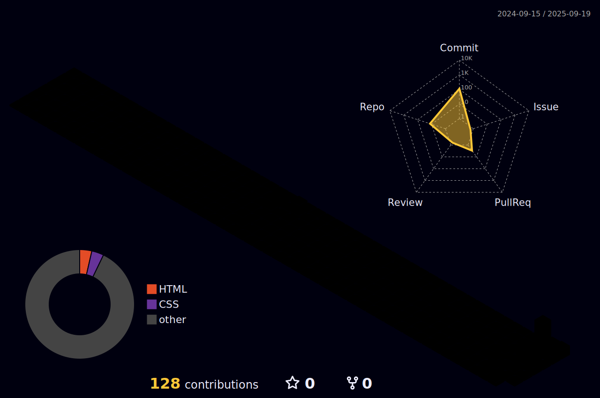
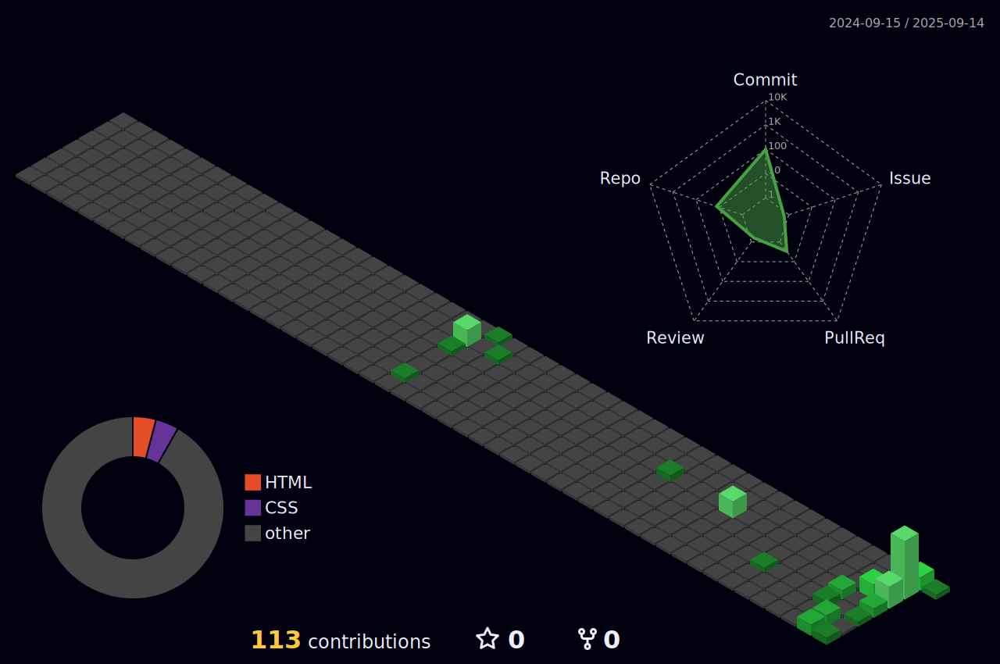

    

    

 

    
<h2>  Sobre mim </h2>

    
 Desenvolvedor Front-End e entusiasta de TI do Brasil, apaixonado por criar experiências digitais únicas. 

    
    <h3>   Um pouco mais de detalhe: </h3>
    <ul>
        <li><a>&nbsp; Tecnologia em Gestão da Informação (TI) — constantemente evoluindo no YouTube e em projetos web. </a></li> 
        <li><a>&nbsp; Atuo com design de interfaces (UI/UX), Figma, desenvolvimento web com HTML, CSS, JavaScript, Vue.js e Tailwind CSS, além de integração com APIs. </a></li> 
        <li><a>&nbsp; Em constante crescimento pessoal, aprimorando habilidades em desenvolvimento web e boas práticas de código limpo. </a></li> 
        <li><a>&nbsp; Transformo ideias em experiências digitais únicas, criando aplicações web funcionais, interativas e visualmente impactantes. </a></li> 
    </ul>
 

  

<h2>  Estatísticas de perfil </h2>

  

    
      
<!--        -->
  

  

      
  
  
        

csaca

 
 

<picture>
  <source media="(prefers-color-scheme: dark)" srcset="https://raw.githubusercontent.com/davidabx1/davidabx1/output/pacman-contribution-graph-dark.svg">
  <source media="(prefers-color-scheme: light)" srcset="https://raw.githubusercontent.com/davidabx1/davidabx1/output/pacman-contribution-graph.svg">
  
</picture>

  

<h2>  Calendário de Contribuições 3D </h2>

<picture>
  <source media="(prefers-color-scheme: dark)" srcset="https://raw.githubusercontent.com/eduardavieira-dev/eduardavieira-dev/output/pacman-contribution-graph-dark.svg">
  <source media="(prefers-color-scheme: light)" srcset="https://raw.githubusercontent.com/eduardavieira-dev/eduardavieira-dev/output/pacman-contribution-graph.svg">
  
</picture>

 gittttttttttttttttttttttt

## 3D Contribution Calendar 📅
 

